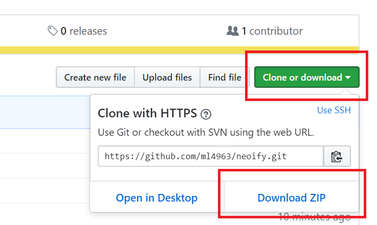
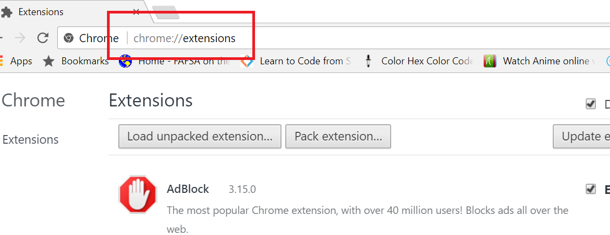
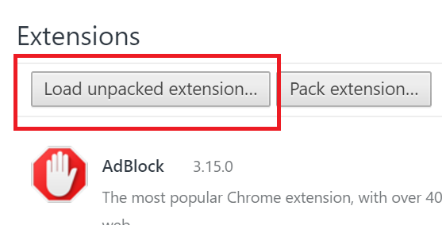
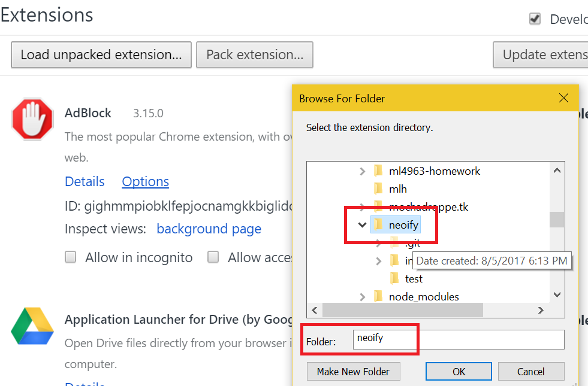

#  neoify 
A neopets application which gives neoifications.

## why:
Neopets is super outdated, flawed, and full of bugs (ily neopets). For instance, there is no way of knowing when someone has made a post in the guild. Instead, you would have to have the webpage opened in another tab and refresh whenever you feel like it. With busy lives, people of course won't have the patience or time for this.

A solution? A chrome extension that alerts people when someone did make a post!

There's also another issue of the filters when typing messages in Neopets being a super pain. You can't type out words like ```uncle``` which is ridiculous since who would ordinarily think that uncle is a bad word? No one, which is why if you include that word in your message and forget to parse that out, Neopets will take you to an error page and force you to click back where your entire message is gone.

Solution? A chrome extension that copies your messaging as you type and highlights any non-neofriendly words!

## current features:
* ```Message Board Notifier``` & ```Guild Ad Board Notifier```: When someone makes a post in the guild or when the guild ad board drops below midway (you can change this as you see fit) on the guild page, you'll get a notification! Let me know if you don't the guild ad board notifier.
* ```Filter search```: When you get on the guild board, there is a text div to the right of the space where you type in. There is a status message on top that says, "YOUR MESSAGE IS GUCCI" if it's neofriendly but this will change to say, "YOUR MESSAGE ISN'T GOOD!", if it detects you typed a non-neofriendly word/phrase. The application will also mimic what you're typing to the right and highlight parts that are non-neofriendly!
	[](https://gyazo.com/86972f8f2d0bb3b9431d3606f3f6d9be)
	- So far, the following words it detects are as follows:
		* 'uncle', 'shit', 'fuck', 'semen', 'rape', 'cum', 'weed', 'nuts', 'anal', 'meth', 'ball', 'ass', 'stupid as', 'kill', 'hole', 'base', 'nigger', 'bad as', 'my space', 'do it', 'expression', 'sex', 'screw', 'crack', 'vagina', 'yuri', 'yaoi'
	- If there is any words that are missing from the above list, let me know!
	

## caveats
* When you first use the extension, you might be flooded with notifications of past posts. This is necessary since the extension's local storage needs to be loaded with all the existing posts for it to have posts to compare with.
* The extension also assumes you need to be signed into Neopets. I'll probably create some error message to check to see if the user is signed in or not in the future. 
* There's also a minute delay when a new post has been made. Will figure out this issue. 

## additional features for future:
* ```Login check error message```: checks to see if the user is logged in or not
* ~~```Filter search```: checks to see if your message contains any non neo-friendly words and highlights them for you before you submit so you don't lose your message~~
* ```A&C notification```: alerts people when a&c occurs
* ~~```Guild Ad Board Notifier```: alerts when the guild ad board falls too below down~~
* ```Safari Portability```: make this available for Mac/Safari users


## how to use:
1. Download the folder/repo. (Unzip the file into a folder!)

2. Navigate to ```chrome://extensions``` in your chrome browser.

3. Check the check box for ```developer mode``` in the upper right hand corner.

4. Select ```load unpacked extension...``` Remember to unzip the file!

5. Select the folder we downloaded in Step #1.

6. select ok and viola! neoify is officially running :)
