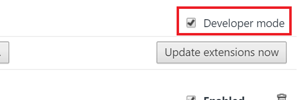

#  neoify 
a neopets application which gives neoifications

## caveats
* When you first use the extension, you might be flooded with notifications of past posts. This is necessary since the extension's local storage needs to be loaded with all the existing posts for it to have posts to compare with.
* The extension also assumes you need to be signed into Neopets. I'll probably create some error message to check to see if the user is signed in or not in the future. 
* There's also a minute delay when a new post has been made. Will figure out this issue. 

## additional features for future:
* login check error message: checks to see if the user is logged in or not
* filter search: checks to see if your message contains any non neo-friendly words and highlights them for you before you submit so you don't lose your message
* a&c notification: alerts people when a&c occurs
* guild ad board notifier: alerts when the guild ad board falls too below down 


## how to use:
1. download the folder/repo (unzip the file into a folder!)

2. navigate to ```chrome://extensions``` in your chrome browser

3. check the check box for ```developer mode``` in the upper right hand corner

4. select ```load unpacked extension...``` Remember to unzip the file!

5. select the folder we downloaded in Step #1

6. select ok and viola! neoify is officially running :)
